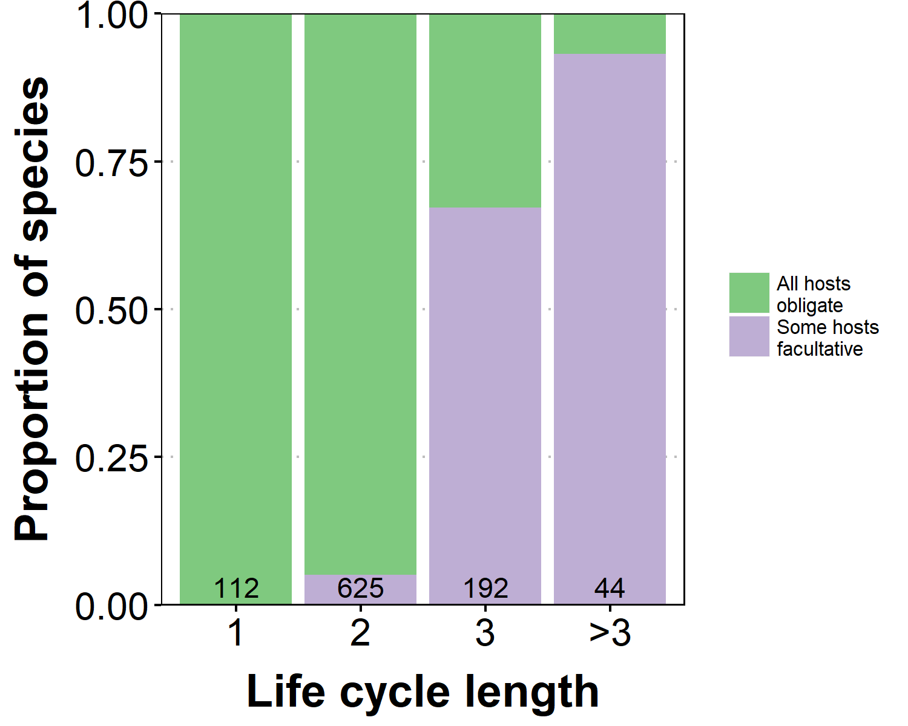

# Flexible life cycles

Many parasites have complex life cycles in which they infect multiple hosts in succession. Some parasites have flexible life cycles; they can complete the life cycle with or without infecting certain hosts. I use a [database](http://onlinelibrary.wiley.com/doi/10.1002/ecy.1680/suppinfo) of helminth (parasitic worm) life cycles to briefly explore such patterns of life cycle flexibility. What kinds of flexibility are most common? And what might this tell us about how these fascinating life cycles evolved? The readable analysis is [here](lc_flexibility.md). I found that life cycle flexibility increases with life cycle length, perhaps more than we would expect by chance. Usually, the facultative hosts are intermediate hosts. Finally, parasites usually do not grow much in their facultative hosts.

