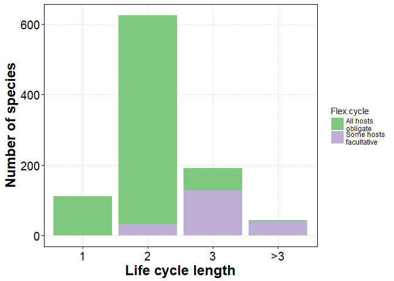
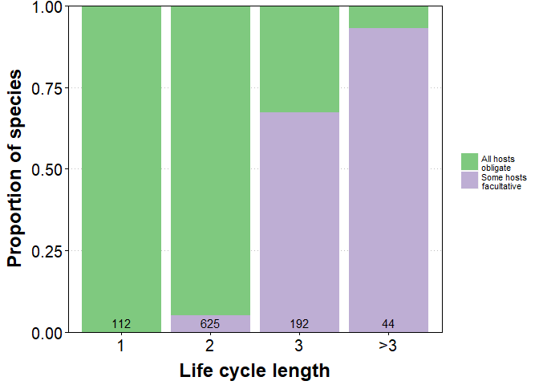
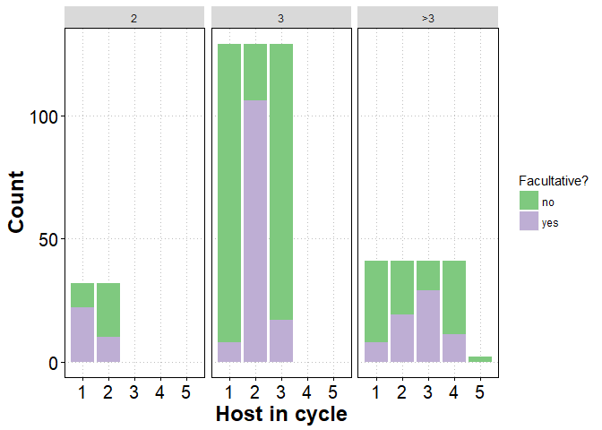
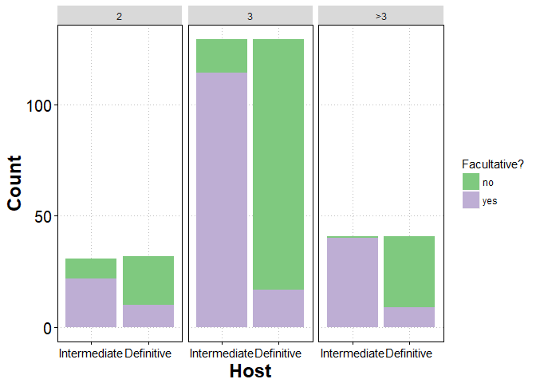
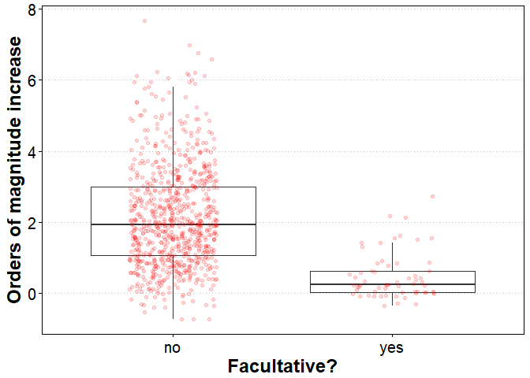
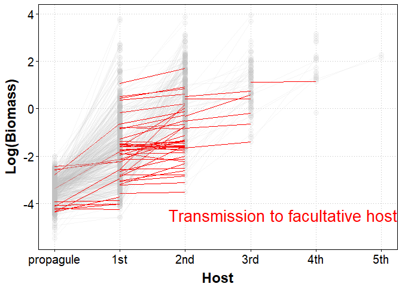

Life cycle flexibility
================

Many parasites have complex life cycles in which they infect multiple hosts in succession. Some parasites have flexible life cycles; they can complete the life cycle with or without infecting certain hosts. I use a [database](http://onlinelibrary.wiley.com/doi/10.1002/ecy.1680/suppinfo) of helminth (parasitic worm) life cycles to explore patterns of life cycle flexibility. What kinds of flexibility are most common? And what might this tell us about how these fascinating life cycles evolved?

First, load libraries, set a plot theme, and import data.

``` r
library(dplyr)
library(ggplot2)
library(tidyr)
library(RColorBrewer)

options(stringsAsFactors = FALSE)

#set theme for plots
theme.o <- theme_update(axis.text = element_text(colour="black", size = 15),
                        axis.title = element_text(colour="black", size = 18, face = "bold", lineheight=0.25),
                        axis.ticks = element_line(colour="black"),
                        panel.border = element_rect(colour = "black",fill=NA),
                        panel.grid.minor=element_blank(),
                        panel.grid.major=element_line(color="gray",linetype = "dotted"),
                        panel.background= element_rect(fill = NA))

# import data
dataH <- read.csv(file="data/CLC_database_hosts.csv", header = TRUE, sep=",")
dataL <- read.csv(file="data/CLC_database_lifehistory.csv", header = TRUE, sep=",")
```

Next, we need to do a bit of wrangling. Add 'life cycle length' variables to main host data table.

``` r
maxLCL <- group_by(dataH, Parasite.species)%>%
  summarize(maxLCL = max(Host.no))
minLCL <- filter(dataH, Facultative == "no")%>%
  group_by(Parasite.species)%>%
  summarize(minLCL = length(unique(Host.no)))

dataH <- left_join(dataH, maxLCL)
dataH <- left_join(dataH, minLCL)
```

For plotting, we want to aggregate the data at the species-level, so let's create a species-level data table that includes life cycle length as a factor.

``` r
# reduce to species level for plot
plot.dat <- select(dataH, Parasite.species, minLCL, maxLCL)%>%
  distinct()

plot.dat <- mutate(plot.dat, Flex.cycle = 
                        if_else(minLCL != maxLCL, "Some hosts\nfacultative", "All hosts\nobligate"),
                      maxLCL.fac = if_else(maxLCL > 3, "4", as.character(maxLCL)))%>%
  mutate(maxLCL.fac = factor(maxLCL.fac, labels = c("1", "2", "3", ">3")))
```

We can visualize the number of species with flexible life cycles using a stack bar chart.

``` r
mypalette <- mypalette <- brewer.pal(3, "Accent") # colors to use in plot

ggplot(plot.dat, aes(x = maxLCL.fac, fill = Flex.cycle)) + 
  geom_bar() +
  scale_fill_manual(values = mypalette[1:2]) +
  labs(x = "Life cycle length", y = "Number of species")
```



Most species in the database have 2-host life cycles, and just a fraction of them are flexible. Parasites with longer life cycles seem to commonly have facultative hosts. Maybe these patterns are clearer when we make a proportional stacked bar chart. To do that, we need to make a proportions table.

``` r
mos.prop <- group_by(plot.dat, maxLCL.fac, Flex.cycle)%>%
  summarize(n = n())
t <- tapply(mos.prop$n, INDEX = mos.prop$maxLCL.fac, sum)

mos.prop$prop <- mos.prop$n/
  t[match(mos.prop$maxLCL.fac, names(t))]
rm(t)
mos.prop
```

    ## # A tibble: 7 x 4
    ## # Groups:   maxLCL.fac [?]
    ##   maxLCL.fac                Flex.cycle     n       prop
    ##       <fctr>                     <chr> <int>      <dbl>
    ## 1          1     "All hosts\nobligate"   112 1.00000000
    ## 2          2     "All hosts\nobligate"   593 0.94880000
    ## 3          2 "Some hosts\nfacultative"    32 0.05120000
    ## 4          3     "All hosts\nobligate"    63 0.32812500
    ## 5          3 "Some hosts\nfacultative"   129 0.67187500
    ## 6         >3     "All hosts\nobligate"     3 0.06818182
    ## 7         >3 "Some hosts\nfacultative"    41 0.93181818

About 5% of worms with 2-host cycles have facultative hosts. For 3-host parasites, this jumps to 67%. Plot these values.

``` r
ss <- group_by(mos.prop, maxLCL.fac)%>%summarize(n = sum(n)) # sample size for fig

outfig <- ggplot(mos.prop, 
                 aes(x = maxLCL.fac, y = prop, fill = Flex.cycle)) + 
  geom_bar(stat = "identity") +
  labs(x = "\nLife cycle length", y = "Proportion of species\n") +
  scale_y_continuous(expand = c(0,0)) +
  scale_fill_manual(values = mypalette[1:2]) +
  theme(legend.title = element_blank(), legend.text = element_text(size = 8)) +
  annotate("text", x = c(1, 2, 3, 4), y = 0.03, label = as.character(ss$n))
outfig
```



``` r
# want to keep so save to file
ggsave(filename = "figs/prop_fac_vs_lcl.png", width = 5, height = 4, units = "in")
```

So the longest life cycles usually include facultative hosts. But which hosts are usually facultative? To answer that, we need to have a table aggregated at the level of 'species stage', i.e. at host 1, host 2, host 3 for species A and so on.

``` r
flexs <- left_join(select(dataH, Parasite.species, Host.no, Stage, Def.int, Facultative),
                   plot.dat)
flexs <- distinct(flexs)%>%
  mutate(Fac_dummy = if_else(Facultative != "no", "yes", "no"))
```

Then we make a stacked bar chart for just the species with facultative cycles. We separate the data into panels according to life cycle length.

``` r
ggplot(filter(flexs, Flex.cycle == "Some hosts\nfacultative"),
       aes(x = Host.no, fill = Fac_dummy)) + 
  geom_bar() + 
  scale_fill_manual(values = mypalette[1:2]) +
  facet_grid(~maxLCL.fac) +
  labs(x = "Host in cycle", y = "Count", fill = "Facultative?")
```



For worms with 2-host cycles, the first intermediate host is more commonly the facultative host. In 3- and 4-host cycles, it is usually the middle hosts that are expendable. In both cases, intermediate hosts are more commonly facultative than definitive hosts, suggesting the reproduction may represent a barrier to eliminating a stage from the cycle. We can re-make this chart by aggregating larval vs adult stages.

``` r
rig <- filter(flexs, Fac_dummy == "yes")%>%
  select(Parasite.species, Def.int, Fac_dummy)%>%
  distinct()

lef <- filter(flexs, Flex.cycle == "Some hosts\nfacultative")%>%
  select(Parasite.species, Def.int, maxLCL.fac)%>%
  distinct()

flexs2 <- left_join(lef, rig)
flexs2 <- mutate(flexs2, Fac_dummy = if_else(is.na(Fac_dummy), 'no', 'yes'))
rm(lef, rig)
```

This plot clearly shows that intermediate hosts are more likely to be facultative hosts across all life cycle lengths.

``` r
flexs2 <- mutate(flexs2, Def.int = factor(Def.int, levels = c("int", "def")))%>%
                   mutate(Def.int = factor(Def.int, labels = c("Intermediate", "Definitive") ))
ggplot(flexs2,
       aes(x = Def.int, fill = Fac_dummy)) + 
  geom_bar() + 
  scale_fill_manual(values = mypalette[1:2]) +
  facet_grid(~maxLCL.fac) +
  labs(x = "Host", y = "Count", fill = "Facultative?") +
  theme(axis.text.x = element_text(size = 11))
```



Does flexibility come at a price? Let's explore the possibility that parasites grow less in facultative stages.

``` r
dataL <- mutate(dataL, biovolume = 
                  if_else(Shape %in% c("cylinder", "thread-like", "whip"), 
                          pi * (Width/2)^2 * Length, # calculate volume as a cylinder
                          if_else(Shape %in% c("coiled", "sphere", "ellipsoid"),
                                  4/3 * pi * Length/2 * Width/4, # calculate volume as a ellipsoid
                                  Length * Width # calculate volume as area for remaining ribbon, leaf shapes
                                  )),
                biovolume = biovolume * 1.1) # covert to biomass with assumed 1.1. g/cm3 tissue density 
```

For each parasite species, we want to calculate how much growth occurs in each stage. But before doing that, we should eliminate a few troublesome values (species with asexual reproduction as larvae and adult male measurements).

``` r
dataL <- filter(dataL, is.na(Asexual))%>% # remove data for asexual species
  filter( !(Stage == 'adult' & Sex == 'm') ) # remove adult males
```

Life starts as a propagule, and there are multiple propagule size measurements for a given species. If the egg hatches, we want to take the free larva stage. If it does not hatch, we would like the embryo stage (this is what hatches from the egg and better represents initial size at growth). However, embryo sizes were not always reported, so in those cases where embryo size was absent, we took egg size. This assumes that the size difference between embryo and egg is rather small, especially relative to the amount of growth conducted in the first host.

``` r
# id species that hatch or not
eggos <- filter(dataL, Host.no == 0)%>%
  select(Parasite.species, Egg.hatch)%>%
  mutate(propagule_selector = if_else(Egg.hatch != "eaten", "free larva", "egg"))%>%
  select(-Egg.hatch)%>%
  na.omit%>%distinct()

# determine whether there is a size measurement for embryo or egg stages
eggos2 <- filter(dataL, Host.no == 0)%>%
  select(Parasite.species, Stage, biovolume)%>%
  group_by(Parasite.species, Stage)%>%
  summarize(x = sum(!is.na(biovolume)))

# combine and spread these two tables
eggos2 <- left_join(eggos, eggos2)
eggos2 <- spread(na.omit(eggos2), Stage, x)

# identify the stage where growth starts for each species
eggos2 <- mutate(eggos2, propagule_selector = if_else(propagule_selector == 'free larva', 'free larva',
                                                       if_else(embryo > 0, 'embryo', 'egg')))

# add selector variable to main life history table
eggos2 <- select(eggos2, Parasite.species, propagule_selector)
dataL <- left_join(dataL, eggos2)
rm(eggos, eggos2)
```

Remove propagule measurements that do not best reflect the initial growth size.

``` r
dataL <- filter(dataL, !(Host.no == 0 & Stage != propagule_selector))
```

Average body size for the stages for each species.

``` r
dataL.sp <- group_by(dataL, Parasite.species, Host.no, Stage)%>%
  summarize(biovolume = mean(biovolume, na.rm=T))
```

Then we calculate absolute and relative body size differences between consecutive life stages, i.e. how much worms grow at a certain life stage.

``` r
dataL.sp <- arrange( ungroup(dataL.sp), Parasite.species, Host.no)%>% # arrange by species and host.no
  mutate(biov = lag(x = biovolume, 1))%>% # make a variable representing size in previous stage
  mutate(abs_diff = biovolume - biov, # absolute size diff
         rel_diff = log10(biovolume) - log10(biov)) # relative size diff

# remove growth values for egg stages; arise when calculating 'species B egg' - 'species A adult'
dataL.sp$abs_diff[which(dataL.sp$Host.no == 0)] <- NA 
dataL.sp$rel_diff[which(dataL.sp$Host.no == 0)] <- NA

# reduce data to just rows where a growth could be calculated
dataL.sp <- filter(dataL.sp, !is.na(abs_diff))%>%
  select(Parasite.species, Host.no, Stage, abs_diff, rel_diff)
```

Combine life cycle and growth tables, and compare growth in facultative vs obligate stages.

``` r
lc_growth <- left_join(flexs, dataL.sp)
```

``` r
ggplot(lc_growth, 
       aes(x = Fac_dummy, y = rel_diff)) +
  geom_boxplot(outlier.color = "white") +
  geom_jitter(width = 0.2, height = 0, color = "red", alpha = 0.15) +
  labs(x = "Facultative?", y = "Orders of magnitude increase") + 
  theme(panel.grid.major.x = element_blank())
```



Parasites grow more in obligate hosts than facultative ones. On average, they increase ~136-fold in obligate hosts and ~3-fold in facultative hosts.

``` r
group_by(lc_growth, Fac_dummy)%>%
  summarize(fold_size_inc = mean(rel_diff, na.rm=T))%>%
  mutate(fold_size_inc = 10^fold_size_inc)
```

    ## # A tibble: 2 x 2
    ##   Fac_dummy fold_size_inc
    ##       <chr>         <dbl>
    ## 1        no    136.074181
    ## 2       yes      2.973565

We can also look at the limited growth of facultative stages in a slopegraph. We need to re-calculate species body volume averages, so that it includes propagule stages.

``` r
dataL.sp <- group_by(dataL, Parasite.species, Host.no, Stage)%>%
  summarize(biovolume = mean(biovolume, na.rm=T))
```

And then re-combine it with the life cycle data.

``` r
slope.plot <- full_join(lc_growth, dataL.sp)%>%arrange(Parasite.species, Host.no)

# add variables for plots
slope.plot <- mutate(slope.plot, 
                   Host.nofac = factor(Host.no, labels = c("propagule", "1st", "2nd", "3rd", "4th", "5th")),
                   trans.to.fac = "no")

slope.plot$trans.to.fac[which(slope.plot$Facultative != "no") - 1] <- "yes" # create variable for coloring the lines
```

The plot below shows how parasite body size changes from host to host. Lines connect stages in successive hosts for each parasite species. Steep slopes indicate a parasite grows substantially in a given host. When we highlight the stages that are facultative, we see comparatively flat slopes. Parasites do not grow much in facultative hosts.

``` r
outfig <- ggplot(data = slope.plot,
       aes(x = Host.nofac, y = log10(biovolume), 
           group = Parasite.species)) +
  geom_point(size = 3, alpha = 0.1, color = "gray") +
  geom_line(aes(color = trans.to.fac, alpha = trans.to.fac)) + 
  labs(x="\nHost",y="Log(Biomass)\n") +
  guides(color = FALSE, alpha = FALSE) +
  scale_alpha_discrete(range = c(0.15, 1)) +
  scale_color_manual(values = c("gray", "red")) +
  scale_x_discrete(expand=c(0.05,0.05)) +
  annotate("text", x = 4.5, y = -4.5, label = "Transmission to facultative host", 
           size = 7, color = "red")
outfig
```



``` r
# want to keep so save to file
ggsave(filename = "figs/lc_flex_slopegraph.png", width = 7, height = 5, units = "in")
```

In summary, life cycle flexibility increases with life cycle length, perhaps more than we would expect by chance. Usually, the facultative hosts are intermediate hosts. Finally, parasites usually do not grow much in their facultative hosts.
